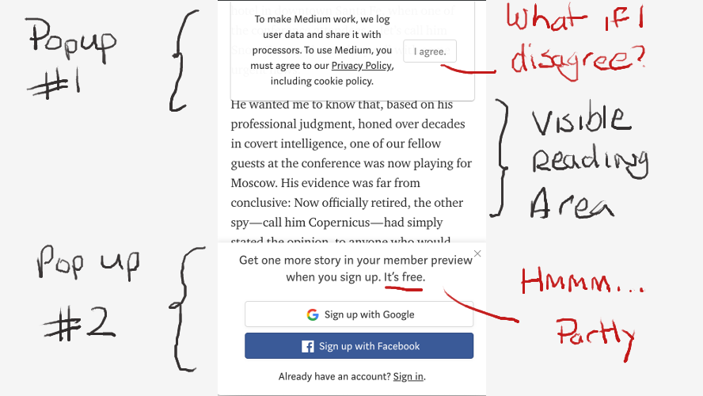
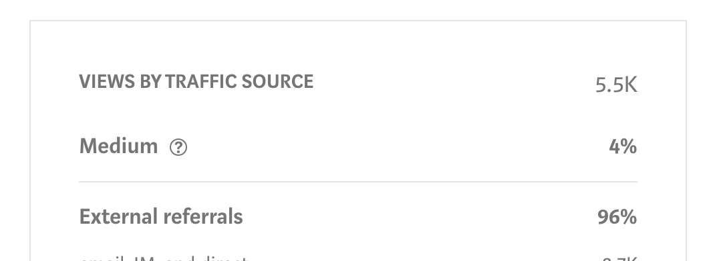
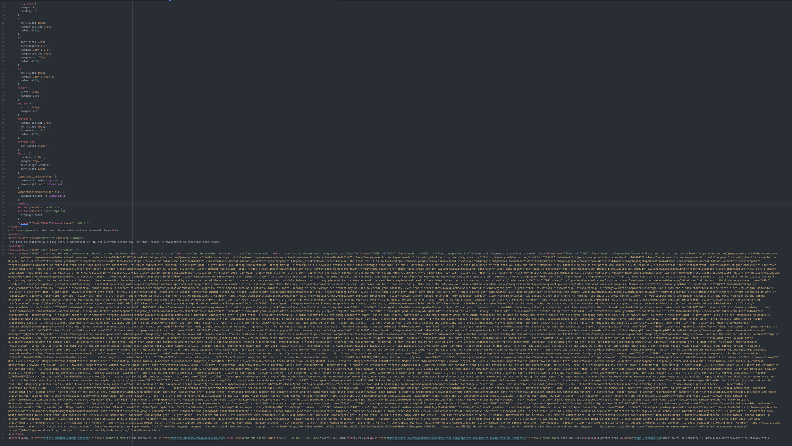

> We are currently witnessing an internet paradigm shift - in reverse.

##In The Beginning
Once upon a time in the heyday of [chain mail](https://en.wikipedia.org/wiki/Chain_letter), [RSS](https://en.wikipedia.org/wiki/RSS) and [web rings](https://en.wikipedia.org/wiki/Webring), before bloggers were bloggers, when people hosted everything on their own servers, content was king.

The internet was weird and wonderful and useful.

Then we all collectively[^1] decided that owning our own content was for losers and posting on a centralized system with likes, shares, and reblogs was clearly the superior approach.

[^1]:
  An argument could be made that we were all hoodwinked by the Mark Zuckerbergs of this world in this regard.

##The Kapitalist Kontent Killers
Pretty soon, the realities of the capitalistic internet kicked in. The content that **we** created was pilfered from our control, peddled to the highest bidder, and plastered in advertisements. Anything that didn't titillate, tickle or trigger was quickly hidden by algorithmic *feeds* and *timelines*.

In [2012](https://en.wikipedia.org/wiki/Medium_(website)), while all this content commercialism was steaming along, a little startup called **Medium** was born. It offered a simple interface and slick experience for writer and reader alike.

When I discovered it in 2014, I was enamoured. After attempting to build my own blogging platform which coincidentally, also launched in 2012, (without success) I saw what I might have achieved with a bit more experience, knowledge and luck.

For many people, Medium seemed like a viable escape from the grip of content killers. Without the effort of coding it yourself, hosting and managing wordpress or whatever else. Medium was cool, man. And you could be cool too.

But of course, it was not to last. As I have come to learn, the cool kids are never *really* your friends. Once again, the platform bloated and profits became the goal at the expense of user experience. Now, practically every article on the homepage is a *"member feature story"*, costing you $5 a month to read - (The first 3 are free, yipee!) - if you can bear to read at all...

But whatever, right? I am not my platform. My articles are still free. I can survive.

Maybe not. There are reports of articles becoming [monetised without consent](https://medium.com/@dan_abramov/why-my-new-blog-isnt-on-medium-3b280282fbae). [Biased discovery](https://writingcooperative.com/my-love-hate-relationship-with-medium-9c672c4303c3) means getting any attention through the platform is next to impossible. About 99% of my traffic comes from Twitter, Reddit and occasionally Hacker News. That's no way to build an audience.

And I'm not the only one to identify that. In 2019, many writers are [losing faith](https://www.joshjahans.com/ditching-medium/) in [third party](https://news.ycombinator.com/item?id=19034676) [services](https://write.as/blog/ending-our-medium-integration).

##Everything Old is New Again.
Hosting used to be expensive, unreliable and complicated. Now, with services like [bluehost](https://www.bluehost.com), [dreamhost](https://www.dreamhost.com/wordpress/) and even [namecheap](https://namecheap.com) offering out-of-the-box wordpress, hosting your own content is easier and cheaper than ever.

For those with tech chops, [github pages](https://pages.github.com/) offers completely free static hosting. In combination with a static site generator like [gatsby](https://gatsbyjs.org) or [hugo](https://gohugo.io), you have the ultimate in flexibility and efficiency without sacrificing control of your content.

In 2019, the tools available to independent bloggers / writers have (sort of[^2]) caught up with platforms that no longer offer meaningful features.

[^2]:
  I have many gripes with current blogging tools that I will cover in a later post. Wordpress is an over complicated disaster for simple blogging. Gatsby is complex, and while the final product is lovely, the setup is not.

##The catch
This all sounds great, but people moved to third party platforms for a reason. So what are we missing out on?

1. **Discovery** is up to you. Platforms don't do much, but they don't do nothing. If you're not actively sharing your content and building an audience externally, you may as well be locked in a dark room whispering to yourself.

2. **Interaction** is difficult. Without the platform to handle user accounts, nobody can leave a comment. "But Wordpress has comments" I hear you moan. Yes. It does. And nobody but bots uses it. You could use a third party service like [disqus](https://disqus.com/), I don't think usage would be high. Personally, I'm just hoping people will tweet me to discuss.

3. **Interaction (Again)** with meaningful light feedback features like 'like' and 'applause' buttons is impossible without using a third party service.

3. **Retention** of your readers is going to be tricky. With algorithmic feeds, they will be spoon fed the content they appear to like better. It's a game you can play to get people coming back. But on a self hosted blog, your only option is a mailing list or other social media / content discovery services, like twitter, reddit etc.

##The Conclusion

This is one of my more popular posts from last year. Over 5 thousand views, not massive but I'm proud. **Less than 4% of those views came from the platform.**

This bothered me, but not enough to actually **do** anything. Then, out of curiosity, I tried exporting my posts. Here's what I got:

That is a HTML file. It looks ok if you open it in your browser. But the content is a single line of mangled HTML tags, arbitrary css and nonsense. **This was enough to make me do something**.

Migrating my old posts is a nightmare that involves copying and pasting text, downloading and reformatting images and basically re-writing my entire blog. Every new post I make on Medium would mean hours of work in the future.

Now, new posts are written in plaintext markdown files, with a simple directory structure: one folder per post. That folder contains all the images and assets used in the post. It is simple, maintainable and most of all, easy to migrate.

I hesitate to use the term "future proof" but it's a step in the right direction.

In the end, Medium, you made my decision for me. Thank you. Next.
