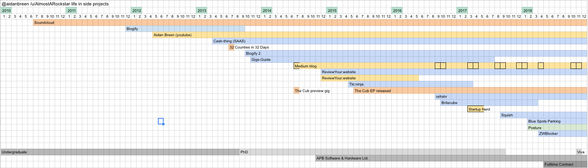
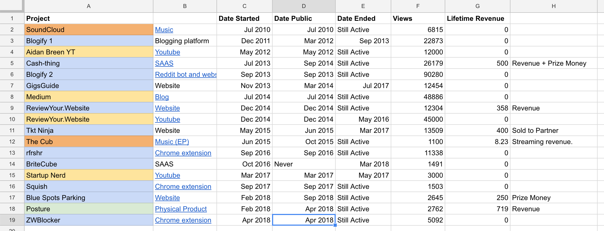
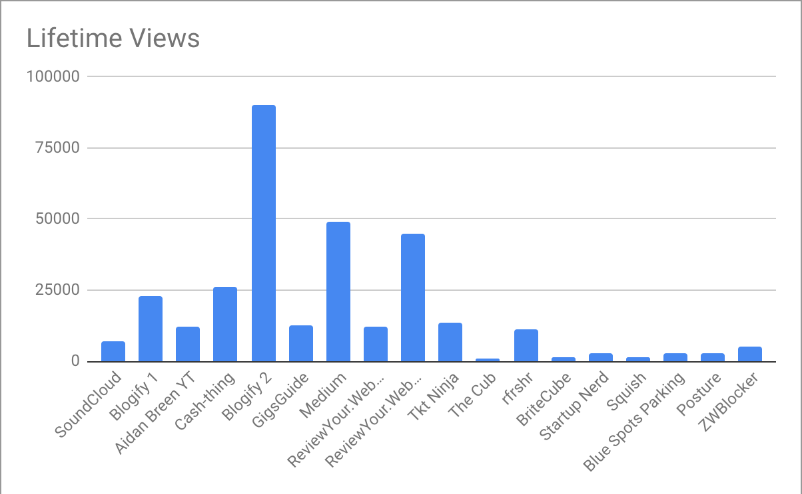
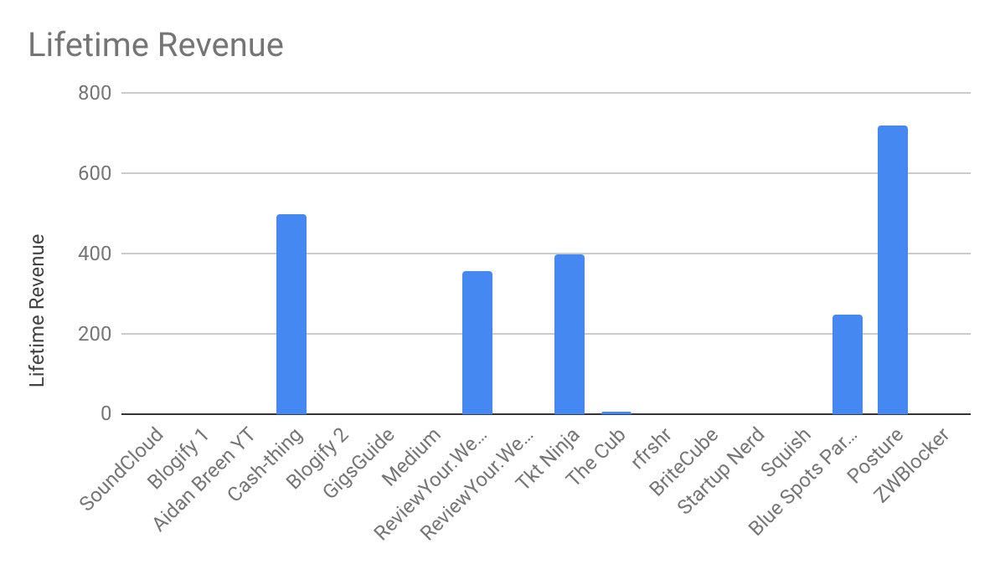

qwertyuiop
It turns out there’s a lot to learn by examining the cadence and variety of your side-projects…

*Figure 1: Projects over time. Check out the original [spreadsheet here](https://docs.google.com/spreadsheets/d/1SAovFyvcWUSptHiIF_4OrJ-IUCxL6fPWg1O7IWKYkrI/edit?usp=sharing).*

I recently defended my PhD and in the process of preparing for the defence, I discovered that an old backup hard-drive was damaged beyond repair. Thankfully I had a further backup, but it got me thinking:

> There’s a lot of stuff here that I probably will never look at again, but it’s important to me that I recognise it’s existence.

I hope I never have to look back at the PHP I wrote when I was learning, but I spent months cobbling together SQL queries and designing objectively terrible pages, and that process is important, at least to me.

Then I thought:

> I’ve shared a lot of this stuff over the years, I wonder how many people have seen the stuff I’ve made?

The projects I could find hard data for include:

- Original Music
- 6 Websites
- 3 Youtube Channels
- 3 Chrome Extensions
- 2 SAAS platforms
- A physical product
- and this blog.

*Figure 2: Project data. Again, from the [spreadsheet here](https://docs.google.com/spreadsheets/d/1SAovFyvcWUSptHiIF_4OrJ-IUCxL6fPWg1O7IWKYkrI/edit?usp=sharing) here. Links included, where possible*

##Findings

I decided to go back as far as 2010, around about when I started my undergraduate degree, and when I started creating meaningful things that could be shared on the internet.

###Relatively steady cadence

Figure 1 above shows pretty clearly that from 2012, I tended to start between 2 and 4 projects a year. There are some gaps (June 2015 — August 2016), and some times where I start a few projects close together (Early 2018), but overall, there’s never really a time where I don’t have a project to work on.

###Blog posts come in spurts
The black bordered cells in Figure one indicate that at least 1 blog post was made that month. They tend to happen together, with large gaps in between. Obviously, I’ve begun to write more frequently lately. I think I also tend to write when I’m in need of a quick win: it’s a goal I can achieve in about a day or less and consider complete.

###Newer projects are less viral

*Left to right: oldest to newest. We should disregard Medium (where this post was originally published) here as new posts were added over time.*

Obviously, older projects are going to have more views, but we would expect the decrease in lifetime views to be somewhat linear. In actual fact, my newer project don’t seem to get anything like the kind of exposure that my older projects got.

I think this might be due to my focus changing from **viral content** (“[blogify 2](http://blogify.org/)” was designed to copy content from reddit and repost the links), to actual **useful tools** (“[Blue Spots Parking](http://bluespots.app/)” is an app to help disabled drivers find accessible parking spaces). Making useful tools that also gain viral traction is a sweet spot I have not yet managed to find.

But perhaps this is also a reflection on how social networks are becoming less effective. Reddit, Facebook and twitter have always been the main way I share my projects.

###Views are not correlated to revenue.

*These figures include prize money. “Reviewyour.Website”, “The Cub” and “Posture” have not received any prize money.*

It’s safe to say that I won’t be quitting the day job any time soon, but I think making any money at all off a side-project is a massive success regardless of the magnitude. I have three main observations here:

1. The project with the most views still made no money. I actually didn’t even put ads on the “Blogify 2” site. I felt it was immoral to profit off it.
2. The physical product performed by far the best in terms of dollars-per-view. It was also the most challenging project though and probably took far more effort-per-view than any other project, if you could measure that.
3. Music is hard.

##Conclusion

It’s probably about time to start something new. If I want to maximize the views, revenue and longevity, I should probably try to build a physical product that is a useful tool with a viral aspect, which has nothing to do with music.

Easy.

