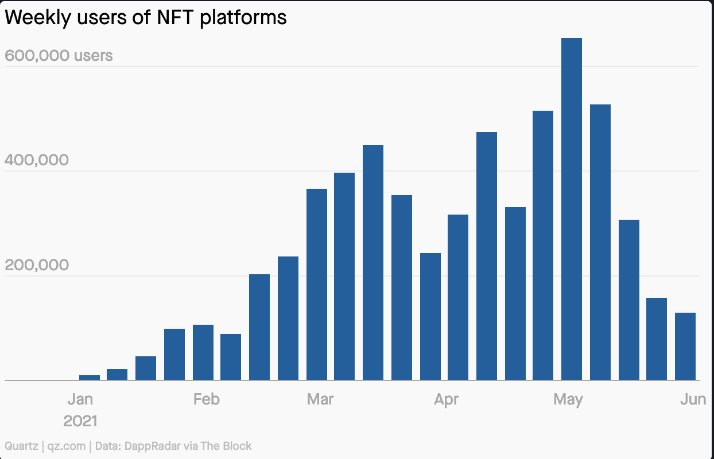

**Bold Claim:** I've just minted [the first truly physical NFT](https://etherscan.io/token/0xabEFBc9fD2F806065b4f3C237d4b59D9A97Bcac7?a=3625).

NFTs, 'Nifties', Non-fungible Tokens. Records of ownership for unique object on the blockchain. As I write this, we are on the [tail end of a boom](https://qz.com/2016058/the-nft-boom-is-over-for-now/) that saw a purely digital artwork [sell for over $69 million USD](https://onlineonly.christies.com/s/beeple-first-5000-days/lots/2020) through the famous Christies auction house. Interesting times.

This isn't my first discussion of NFTs. In 2017 my post ["How does cryptokitties work?"](https://medium.com/@aidobreen/how-does-cryptokitties-co-work-e5071c0abf73) includes a definition and explanation of non-fungibility. However, back then NFTs meant silly digital cats, not serious $69mm artworks.

## The Problems with NFTs

Let's assume Ethereum is here to stay, volatility eventually subsides, and the user experience of crypto improves to such an extent that crypto-currencies are ubiquitous. NFTs still have problems:

1. **Digital assets are not unique.**   
Anybody can copy Beeples artwork onto their computer. Ownership is in the eye of the NFT hodler. 
2. **Assets are not forever.**   
Most NFTs point to an asset stored on IPFS. Contrary to popular belief, this is not permanent.
3. **Asset-to-token link is broken.**   
Anybody can create a second NFT pointing to the same digital file, or a copy of the digital file.

## Solution 1: Use Physical Assets

Digital assets are not unique, but physical assets are.

Physical artworks have been around a long time. And since we stopped making them on cave walls, artworks have been owned, traded, copied, stolen, forged, and counterfeited. As a species, we have gotten pretty good at detecting copies. It's impossible to truly duplicate a physical artwork and extremely difficult to produce a convincing forgery. In most circumstances, hazy provenance is exploited to sell a complete fake to unsuspecting collectors.

NFTs fix provenance. They don't fix duplicates.

## Solution 2: Use Physical Assets (again)

Assets are not forever. 

[Foundation](https://foundation.app/) is an NFT platform for art. Here's what they have to say about storing the actual artwork for NFTs they create:

> When you upload your artwork on Foundation, it will be sent to IPFS so the network of nodes participating in the IPFS protocol can host it. Foundation’s smart contract will point to IPFS with a link to the image, URL, description, and title. 

Your NFT is only as good as the IPFS file it points to. If the IPFS file disappears, your NFT represents nothing.

But the IPFS file wont dissappear, right? Here's what IPFS have to say about it:

>To ensure that data persists on IPFS, and is not deleted during garbage collection, data can be pinned to one or more IPFS nodes.

Uh, what?  
IPFS is often touted as "the permanent web" but that is a huge red-herring. *Permanent* in this context really only means immutable, or unchanging. And the files you upload through foundation (and any other NFT platform as far as I can tell) **WILL NOT EXIST FOREVER.** 

## Solution 3: Embed the NFT in the asset.

Asset-to-token link is broken. 

As I've mentioned, NFTs simply point to an ephemeral file that describes the asset. This is easy when you want to create an NFT for something that already exists. 

There is [some](https://www.youtube.com/watch?v=99wzZFrPJxc) [discussion](https://www.reddit.com/r/NFT/comments/m04ec8/nfts_for_physical_art/) about the best way to link a physical artwork to an NFT. It's mostly rubbish. Amoung the suggestions are:
- "Upload a picture/scan of the art."
- "Destroy the physical art after you mint the token" (Please don't)
- "Declare the physical piece a step in the process of created a digital artwork." ("I declare bankrupty!")

Hopefully it's clear by now why all of these suggestions are painfully stupid.

[Flipkick](https://www.flipkick.io/) have an interesting approach - embedding an NFC chip in an artwork. But I reckon that is flawed also:

- Their services are not available to the public.
- You have to trust flipkick to validate the NFC chip.
- You need to have an NFC reader to validate it at all.
- You have to trust the lifespan of the NFC chip.

The solution is to do things in reverse:

**First:** Create the NFT.  
**Second:** Physically embed the NFT contract address and tokenID into the artwork.

This approach has a few challenges. 

1. NFTs are permanent (and persistent).  
*You can't add a picture of the final artwork after it's done.*
2. We need a way to encode the address+ID into the artwork without affecting the artwork.  
*Flipkick do this with NFCs. I think there is a better analogue approach that anybody can do at home, and that will last for the lifetime of the artwork.*
2. We need to make sure the embedded address+ID can't be changed or modified.  
*My approach should handle this. The prototype is under construction.*
5. We need a way to encode and decode any address+ID - because we wont know the address+ID until after the token is minted.  
*I've got this covered.*
6. You need to include a description of the encoding method in the NFT.

