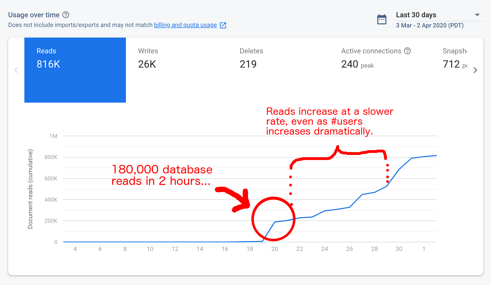

Of all the weird domain names I have bought over the years, [Table.Fish](https://www.table.fish) is an unlikely late bloomer. Originally purchased to be the home of a restaurant table booking app, it was quickly shelved and lay dormant for over a year. It's now home to my newest passion project: a virtual table quiz platform.

It's a simple concept, the quizmaster hosts a live stream on youtube with the questions. Players can submit their answers through our app.

Table.fish is growing rapidly in a world where pandemic has shut down mass gatherings and public events. This is a story about how we have managed to build a platform in days that can handle hundreds of users simultaneously, let scorers mark over 10,000 answers in minutes, and most importantly, raise over €2,500 for charity.

##A long long time ago...

In mid march 2020, before the total lockdown we have now, when working from home was recommended Chris (my [Exante](https://exante.io) co-founder) invited me to join a virtual quiz. He wanted to host 10 teams, submitting answers over whatsapp and calculating scores in excel. Managing it was a nightmare. Sending in answers was a pain. It took him ages to score answers. But people still sent him 'entry fees', just like a real life table quiz. I thought we could do much better...

By the following quiz, I had a firebase application up and running. It let you submit answers through a form, and it displayed them on an admin page with some buttons to mark each answer correct or incorrect. The scoreboard could then be displayed to each user, which updated as scores came in. I was happy.

(Yes, above image is a photo of a screen...It's all I could find without spinning up an old version. You get the idea.)

##3...2...1...

Next quiz (Friday, 20th March) we had a few more teams but were operating off a default cloudfront domain. Friends and family started to sign up. We had 28 teams in total. Assuming about 4 people on a team, that's over a hundred people on the second outing! And our "pay what you want" model was working. Over €200 was contributed after the quiz.

The 'show' went well. Some minor bugs. A couple teams accidentally submitting answers early. An easy fix with a confirmation dialog. A missing scoresheet. hmm. Ok, I'll investigate.

I spent a weekend on it and by the next quiz on Tuesday, we had a domain name, much nicer UX, better game controls for the quiz master and a little more functionality for scoring. It felt good to have real users on my system, but also terrifying to think about what would happen if it broke...

##Double Trouble.

The next quiz blew us away. We had nearly twice the teams join us. Most of them we didn't know. and with that growth came some growing pains.

1. It turns out you can't trust user input. Even if you think you're being careful. One team managed to set their team name to 'undefined'. It shouldn't have been possible, but it happened. The result was our scoring page threw an error and completely crashed after the first round. Thankfully I was able to push a frantic update mid-quiz to handle the error.
2. I thought I was out of the woods. Sadly not by a long shot. As soon as the scoring page came back, our scorers started experiencing massive lag. I had set up the paging slightly wrong. Each new score sheet appeared after the last, but didn't replace it. Corrected score sheets were invisible to the scorer, but still in the DOM, taking up memory. Another live fix was necessary. This time, I only had the time to implement a crude drop down to let scorers skip ahead to a page in multiples of 10. Now they could proceed with frequent refreshes and at least keep up with the incoming answer sheets.
3. My heart rate must have been over 200 at this stage. I had just returned to the living room where my wife and her family were doing the quiz. I sat down, opened a beer, ready to enjoy the second half of the quiz. Then it ALL went haywire.  
The answer sheets stopped loading for players. The admin panel stopped updating the game state. The scoring stopped updating. uhh....I ran back upstairs.  
We had hit the free usage limit on firebase. 80,000 database reads. I was kicking myself. Firstly, why didn't I see this coming? Secondly, how could the system be making 80,000 reads? That's madness!  
Thankfully the fix for this one simply involved a credit card.

By the end of the show we had made 180,000 db reads. Something was up!

##What's up doc?

**Simply answer:** The scoreboard was inefficient.

**Less simple answer:** The scoreboard was embarrassingly inefficient, I'm almost too ashamed to share it.

The first (and quickest, at the time) solution that occurred to me was to create a scoreboard component, get every user in the game, get every answer sheet for each of those users, then display them in a table. I obviously didn't think about it very hard. This approach resulted in the scoreboard being generated fresh for every user that viewed it.

For a rough estimate: 80 users reading 80 other users with 8 answer sheets and 8 rounds. 80 * 80 * 8 * 8 = 409,600

The actual number is much smaller because the scoreboard for the first round requires less reads in total. But you get the idea.

Quite frankly, if this was a university assignment I would have barely passed. Thankfully that is all behind me and the real world is much more forgiving.

My updated solution is to only re-calculate the scoreboard once after each round is fully scored, and store the result somewhere that can be accessed in a single database read by all users. This reduces the db reads dramatically.

##Conclusion

Table.fish is far from finished. As a tech challenge, I haven't even addressed the scoring, which will make a whole post in itself. As a product, the user base keeps growing and the contributions keep coming. We're on an exponential curve right now and it doesn't seem to be slowing. 

There's a lot to do...
