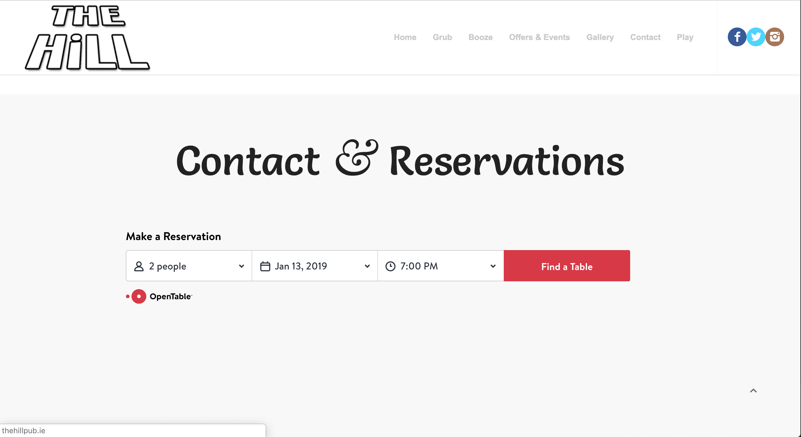
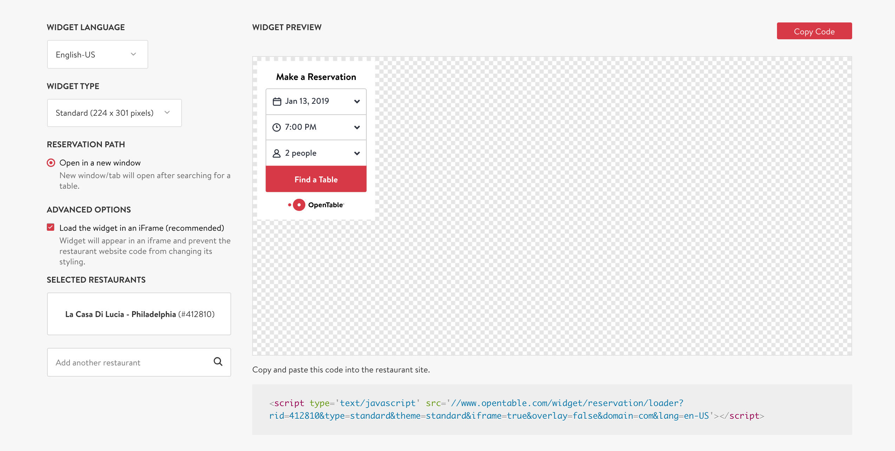
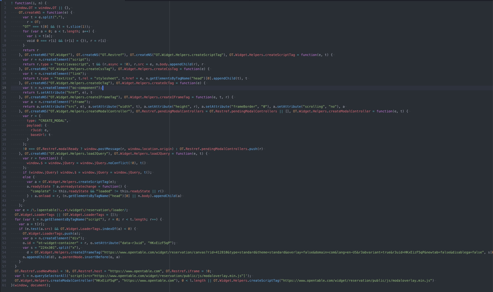
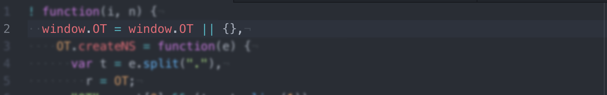
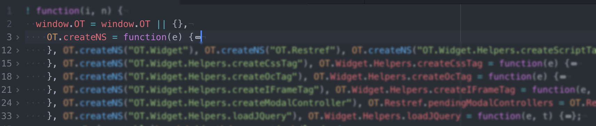
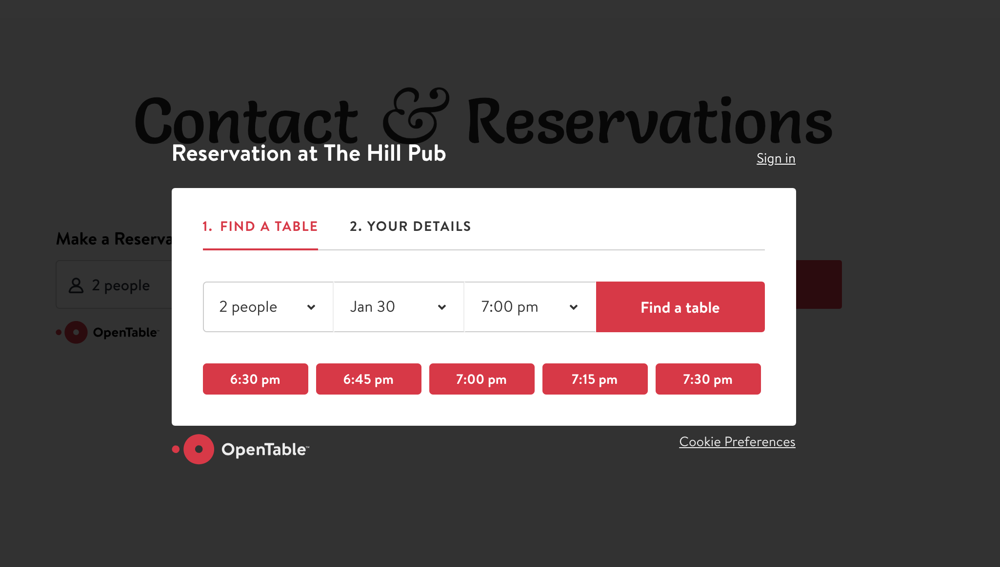
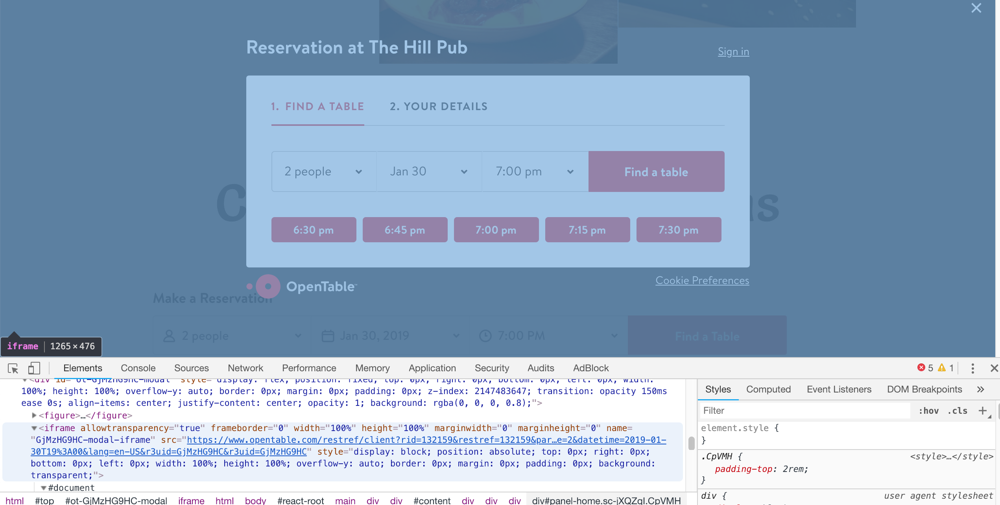

You may be familiar with OpenTable, a service built around restaurant bookings. One of their main features is an embeddable widget that restaurants can insert in their website to let patrons reserve a table. Here’s what it looks like in the wild:



This widget was generated by the OpenTable widget builder page like so:



Try it yourself at: [opentable](https://www.opentable.com/widget/reservation/preview?rid=412810&language=en-US&domainId=1&countryCode=US)

As you can see, we can change a few settings and then just copy the code into our own website. Pretty handy, but how does it work?

##The loading script

The script we copy is simply a ```<script/>``` tag, which is used to load javascript. We can simply copy the URL into a browser window to see the code that would be loaded:


Yikes. It’s obviously been minified (as you would expect) but hope is not lost. Let’s copy this into a text editor and run some auto formatting:



Ok, that looks a bit more approachable. For reference, I’m using the Atom text editor with Atom-beautify for auto formatting.

##First impressions

First thing to note here is the outer function syntax:
```javascript
! function(i, n) {
  ...
}(window, document);
```

This is a **self-executing anonymous function**. That is, the function is called as soon as it is loaded (“self executing”), it doesn’t have a name or a variable reference (“anonymous”). This is a common approach for plugins and widgets, and was particularly common for jQuery plugins. In my experience, I have seen this mostly using the double bracket pair syntax: ```(function(){})()``` but this does the same thing.

The ```!``` is simply a unary operation (a logical “not”) that forces javascript to execute the function. If the output of the function was stored in a variable, it would be negated, but since the function doesn’t return anything, and the result isn’t stored or used anywhere, it has no effect.

Next thing to note is that ```window``` and ```document``` are passed into the function and will be referenced by ```i``` and ```n``` respectively inside the function.

Let’s find and replace the occurrences of i and n for the sake of clarity…

##Defaults and the Comma Operator

Looking at the internals of the function, we see that the widget starts by assigning stuff to the window, but it does this is a fairly interesting way, first by checking for an existing ```window.OT``` value using ```||``` , and if none exists (ie. if ```window.OT``` is undefined), the code after the ```||``` is executed.



**Why would we bother checking for an existing window.OT value?**

I assume this is to handle a website embedding the code in more than one place. This way we only ever execute the code after the ```||``` once.

So, after the ```||```…



*Note: I have “folded” each function to highlight the comma operator syntax.*

We see an empty object followed by a comma…weird.

Usually we would expect a comma to be inside a function declaration, an array or an object, right? In this case, the comma is used as an **operator.**

> The comma operator evaluates each of its operands (from left to right) and returns the value of the last operand.  
> [MDN](https://developer.mozilla.org/en-US/docs/Web/JavaScript/Reference/Operators/Comma_Operator)

Based on that description, the empty object is “evaluated” [see note below], then a function is declared and assigned to OT.createNS [note 2], this function is then called a few times.

**Note: Why the empty object? If each step is evaluated and only the last value is returned, what use is the empty object?**

By playing around a bit, I have discovered that the empty object is necessary to avoid an error when assigning the ```OT.createNS``` function right after the ```||``` operator. Specifically: “Uncaught ReferenceError: Invalid left-hand side in assignment”.

##The CreateNS function

This function gets called a few times, and as far as I can tell, it is simply used to set up the OT object with nested attributes. I think NS might stand for Name Space, but that’s a guess.

In short, it converts the string “OT.something.else.entirely” to an object.

It’s fairly straightforward, with the only interesting bit being the use of the ```void``` operator:

> The void operator evaluates the given expression and then returns undefined.  
> [MDN](https://developer.mozilla.org/en-US/docs/Web/JavaScript/Reference/Operators/void)

##The OT functions

The next few lines use the createNS function to ensure the OT object has an attribute of a certain name, and then assigns a function to each of these attributes. The functions are self explanatory:

createScriptTag, createCssTag, createOcTag, createIFrameTag, loadJQuery

##The Modal

All of this extra work is building up to being able to inject a “modal” into the host page. The modal in question appears when you click the “find a table” button:



Modals are a fairly challenging (and controversial!) UI element. They have to sit over everything in your page, position themselves in the center of the screen, and go away when you need them to.

I try to avoid them if possible, as they also lead to accessibility issues and pose a challenge for screen readers.

All this leads to complex CSS and JS, which isn’t apparent in the code that we copied…so where is it?

Going even further down this rabbit hole, we can inspect the modal and discover that the contents actually come from an i-frame. That means the UI and elements are really a completely separate web page, loaded from a different server, simply placed over the host website.



The code we are vivisecting really only builds the ```src``` for the iframe, passing in the details of the specific restaurant.

From here, it is quite straightforward and well beyond the scope of this post. The modal i-frame is a fully functional web application (a react app if the class name “react-root” is to be believed).

##Conclusion

We have seen some interesting patterns here — most of them (the comma operator usage for example) are fairly specific and probably the result of a preprocessor trying to produce a smaller JS. I’m not too sure what, how or why, but hopefully somebody can comment with an explanation.

The whole thing, however, boils down to a fairly simple approach:

- Get the user to copy a ```<script>``` tag in the host page.
- Use a self executing anonymous function in the ```<script>``` to…
- Insert an ```<i-frame>``` tag close to the script tag, and…
- Load your widget from your own server.

Thanks for reading!
